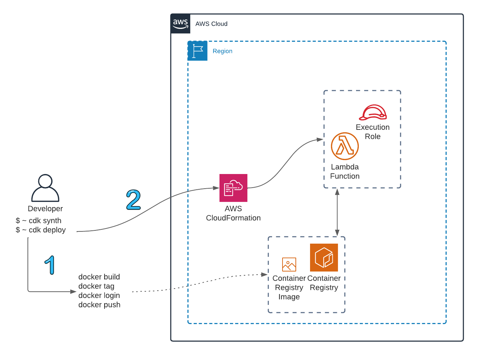

## Overview



This is an example [CDK application](https://aws.amazon.com/cdk/) that deploys a container image for use by AWS Lambda. Specifically, the container has Kerberos specific libraries installed so the Lambda function can make calls such as `kinit`.

The container definition and build commands can be found in the [Dockerfile](src/Dockerfile). The image is based on the [AWS Lambda Python 3.7 runtime environment](https://docs.aws.amazon.com/lambda/latest/dg/python-image.html#python-image-base).

### Deploying the application

To deploy the application in your environment, you must first [install the AWS CDK](https://docs.aws.amazon.com/cdk/v2/guide/getting_started.html#getting_started_install) and subsequently [bootstrap your environment](https://docs.aws.amazon.com/cdk/v2/guide/getting_started.html#getting_started_bootstrap).

```bash
$ npm install -g aws-cdk # Install aws-cdk with NPM
$ cdk bootstrap aws://<account ID>/<region> # Bootstrap your account in the region of your choice
```

Once complete, create a virtual environment and install the dependencies defined in the Pipfile. I chose to use [pipenv](https://pipenv.pypa.io/en/latest/) for python dependency management, but any python package manager can be used here.

```bash
$ pipenv --python 3.9 # create a new environment
$ pipenv shell # activate the environment
$ pipenv install # install the dependencies from Pipfile.lock
```

Once the dependencies are installed, you can now synthesize the application:

```bash
$ cdk synth
```

This will generate the CDK application and corresponding CloudFormation template. If acceptable, you can then deploy this:

```bash
$ cdk deploy
```

### S3 Bucket Integration

Included in the CDK application are additional constructs that have been commented out but are available for illustrative purposes. This includes an S3 bucket that also grants the Lambda's execution role read-only access to the S3 bucket. You can uncomment these additional resources and rerun `cdk synth` to see what new resources would be created and deployed.
